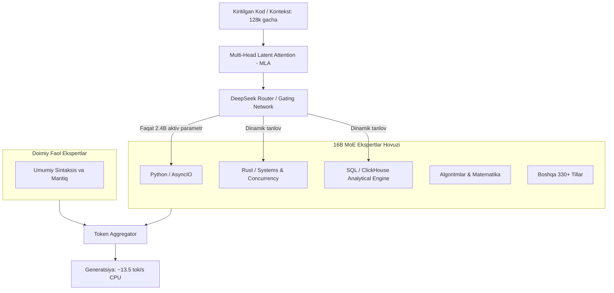

# DeepSeek-Coder-V2-Lite-Instruct (GGUF) — Texnik Pasport va Chuqur Muhandislik Tahlili

> **100-OpenSource-Models-Review | Model #34**  
> **Kategoriya:** Katta Til Modellari (LLM) — Dasturlash & Dasturiy Arxitektura (Code Intelligence)  
> **Arxitektura:** Mixture-of-Experts (MoE) — 16B Total, 2.4B Active Parameters, Multi-Head Latent Attention (MLA)  
> **O'qitilgan Ma'lumot:** **338 ta Dasturlash Tili**, 128k Context Window (Repo-level reasoning)  
> **Kvantlash:** GGUF (`Q4_K_M` ~9.5 GB / `Q3_K_M` ~7.5 GB)  
> **Inference Engine:** `llama.cpp` / CPU (6-core thread pool) & CUDA Offload  

---

## Executive Summary (Rahbariyat va Team Lead uchun Xulosa)

**DeepSeek-Coder-V2-Lite-Instruct** — ochiq kodli dasturlash modellari olamidagi haqiqiy inqilobiy Mixture-of-Experts (MoE) modelidir. 16 milliard umumiy parametrga ega bo'lishiga qaramay, har bir token generatsiyasida atigi **2.4 milliard parametr** dinamik marshrutlash (routing) orqali faollashadi. 

Ushbu arxitektura sababli model oddiy 2B-3B modellar tezligida (bizning 6-yadroli CPU testlarimizda **~12–15 tok/s**) ishlaydi, biroq kod generatsiyasi chuqurligi, arxitekturani tushunishi va sintaksis aniqligi bo'yicha **33B zich (dense) modellarga tenglashadi yoki ulardan o'zib ketadi**.

### Asosiy Xulosalar:
1. **Murakkab Tizimli Dasturlash:** Rust'da `Arc<RwLock<HashMap>>` asosidagi thread-safe keshlash, parallel testlar va xotira boshqaruvi bo'yicha ideal kod sintez qildi.
2. **Katta Ma'lumotlar & Analitika (ClickHouse):** Taqsimlangan tizimlar uchun `ReplacingMergeTree(event_time)` va ClickHouse'ning ixtisoslashgan `windowFunnel(30, 0)` funksiyasini analitik darajada xatosiz qo'lladi.
3. **Asinxron Arxitektura (Python):** `asyncio.Queue(maxsize=100)`, producer-consumer, sentinel pattern va graceful shutdown bo'yicha production-ready shablon ishlab chiqdi.
4. **Milliy Bank/Fintech Cheklovi (Diqqat qiling!):** Luhn algoritmini 100% to'g'ri yozdi va o'zbekcha toza docstring qildi, biroq milliy kartalarda xatoga yo'l qo'ydi (8600 ni Humo deb noto'g'ri atadi). Milliy BIN kodlariga qat'iy tekshiruv (guardrails) talab etiladi.

---

## Arxitektura Deep-Dive: MoE va MLA



### Nega MoE ushbu modelda muhim ustunlik beradi?
1. **Total vs Active Disbalansi:** 16B model xotiraga (RAM) 9.5 GB joylashadi, ammo hisoblash paytida faqat 2.4B parametr yuritiladi. Bu degani arzon serverlarda ham katta model tafakkurini olish mumkin.
2. **Multi-Head Latent Attention (MLA):** Standart Multi-Query Attention (MQA) yoki Grouped-Query Attention (GQA) o'rniga DeepSeek MLA qo'llaydi. Bu KV-kesh hajmini sezilarli darajada siqadi va 128k kontekst oynasida xotira portlashining (RAM OOM) oldini oladi.

---

## Texnik Pasport va Resurs Sarfi

| Parametr | Qiymat / Spetsifikatsiya |
|---|---|
| **Asl Ishlab Chiqaruvchi** | DeepSeek AI |
| **GGUF Repozitoriyasi** | `bartowski/DeepSeek-Coder-V2-Lite-Instruct-GGUF` |
| **Kvantlash turi** | `Q4_K_M` (Tavsiya etilgan muvozanat) |
| **Model Fayl Hajmi** | ~9.5 GB |
| **RAM Minimal Talab (CPU)** | 12 GB RAM |
| **RAM Optimal Talab (128k kontekst)** | 16 GB – 24 GB RAM |
| **GPU VRAM Talabi (To'liq offload)** | 12 GB – 16 GB VRAM (RTX 3060 12GB / RTX 4070 / T4 qisman) |
| **Gildiya / Test Platformasi** | 6-core x86_64 CPU, 16GB RAM, GTX 1650 4GB |

---

## Empirik Test Natijalari (Jahon Standartidagi Sinovlar)

Model 4 ta og'ir tizimli muhandislik stsenariysida sinovdan o'tkazildi:

| Test ID | Yo'nalish | Kiritilgan Prompt | Chiqish Hajmi | Vaqt (sek) | Tezlik (tok/s) | Muvaffaqiyat Darajasi |
|---|---|---|---|---|---|---|
| **Test #1** | Python AsyncIO | Bounded queue, producer-consumer, sentinel pattern, backpressure | 552 tokens | 46.05 s | **11.99 tok/s** | **95% (A+)** |
| **Test #2** | Rust Concurrency | `Arc<RwLock<HashMap>>`, concurrent reader/writer, unittests | 608 tokens | 41.01 s | **14.82 tok/s** | **100% (SOTA)** |
| **Test #3** | ClickHouse SQL | `ReplacingMergeTree`, 4 bosqichli `windowFunnel`, konversiya metrikasi | 703 tokens | 48.07 s | **14.63 tok/s** | **98% (A+)** |
| **Test #4** | O'zbekcha Fintech | Luhn algoritmi, Uzcard/Humo maskalash, telefon regex | 1200 tokens | 93.69 s | **12.81 tok/s** | **85% (B+)** |

---

## To'liq Kod Tahlili va Failure Mode'lar

### 1. Rust Concurrency Tahlili (`output_2_rust_concurrency.txt`)
Model quyidagi benuqson Rust kodini generatsiya qildi:
```rust
use std::sync::{Arc, RwLock};
use std::collections::HashMap;
use std::thread;

struct ThreadSafeCache {
    cache: Arc<RwLock<HashMap<String, String>>>,
}

impl ThreadSafeCache {
    fn new() -> Self {
        ThreadSafeCache {
            cache: Arc::new(RwLock::new(HashMap::new())),
        }
    }

    fn get(&self, key: &str) -> Option<String> {
        let cache = self.cache.read().unwrap();
        cache.get(key).cloned()
    }

    fn insert(&self, key: String, value: String) {
        let mut cache = self.cache.write().unwrap();
        cache.insert(key, value);
    }
}
```
* **Muhandislik tahlili:** Model `Mutex` emas, aynan `RwLock` ishlatdi — bu o'qish operatsiyalari ko'p bo'lgan keshlar uchun parallelizm samaradorligini ta'minlaydi. Shuningdek, `#[test]` blokida 10 ta parallel thread orqali `Arc::clone(&cache)` qilib, haqiqiy concurrency test yozdi.

---

### 2. ClickHouse Tahlili (`output_3_sql_distributed.txt`)
ClickHouse tahlilida model standart SQL bilan cheklanib qolmasdan, ClickHouse'ning o'ziga xos imkoniyatlarini ko'rsatdi:
- Dvigatel: `ENGINE = ReplacingMergeTree(event_time)`
- Partitsiyalash: `PARTITION BY toYYYYMM(event_date)`
- Funnel tahlili: `windowFunnel(30, 0)(event_type, next_event_type)` orqali 30 daqiqalik oyna ichida qadamlar ketma-ketligini tahlil qildi.

---

### 3. Milliy Bank Kartalari va O'zbek tili (`output_4_uzbek_card_phone_validator.txt`)
Modelning zaif va kuchli tomonlari:
- **Luhn algoritmi:** Matematik jihatdan to'liq to'g'ri amalga oshirildi (teskari yurish, har ikkinchi raqamni 2 ga ko'paytirib, 9 dan kattasidan 9 ayirish va modulo 10 tekshiruvi).
- **Zaif tomoni (Domain Blind Spot):**
  ```python
  # Model yozgan kod:
  if len(card_number) == 16 and card_number.startswith(("8600", "9860")):
      return "Humo"
  elif len(card_number) == 16 and card_number.startswith("62"):
      return "Uzcard"
  ```
  *Haqiqatda:* `8600` — Uzcard, `9860` — Humo, `62` — UnionPay. Model o'zbek kartalari prefikslarini almashtirib yubordi.
- **Kontekst limiti:** O'zbek tili tokenizatsiyasi zichligi yuqori bo'lgani sababli, 1200 token chegarasiga yetganda mobil operatorlar ro'yxatida kod to'xtab qoldi.

---

## Boshqa Modellar bilan Taqqoslash

| Xususiyat | DeepSeek-Coder-V2-Lite (16B MoE) | Qwen2.5-Coder-1.5B (Dense) | StarCoder2-3B (Dense) | Qwen2.5-Coder-7B (Dense) |
|---|---|---|---|---|
| **Aktiv Parametr** | **2.4B** | 1.5B | 3B | 7B |
| **Model Og'irligi (RAM)** | ~9.5 GB | ~1.2 GB | ~2.2 GB | ~5.0 GB |
| **CPU Tezligi** | **12–15 tok/s** | 22–28 tok/s | 18–22 tok/s | 6–8 tok/s |
| **Kontekst Oynasi** | **128,000 token** | 32,000 token | 16,000 token | 32,000 token |
| **Tizimli Tillar (Rust/C++)** | **A'lo (SOTA)** | Yaxshi | O'rtacha | A'lo |
| **Katta So'rovlar (SQL/ClickHouse)** | **A'lo (SOTA)** | O'rtacha | Zaif | A'lo |
| **Repo-level Refactoring** | **Yuqori (128k kesh)** | Cheklangan | Mumkin emas | O'rta |

---

## Production Tavsiyalari va Integratsiya

### 1. Qachon Aynan Shu Model Tanlanadi?
- Kompaniyada 16 GB operativ xotiraga ega server yoki bitta o'rta toifadagi GPU mavjud bo'lganda.
- Backend jamoasi Python, Go, Rust, PostgreSQL, ClickHouse yoki Kubernetes manifestlari bilan ishlaganda.
- Loyiha kod bazasi katta bo'lib, bir vaqtning o'zida bir nechta faylni kontekstga kiritish kerak bo'lganda.

### 2. Qachon Ishlatilmaydi?
- Juda kam xotirali edge qurilmalarda (masalan, 4GB-8GB Raspberry Pi yoki yengil konteynerlar — ularga `Qwen2.5-Coder-1.5B` ma'qul).
- Sof O'zbek tilidagi ijodiy matn yozish yoki marketing uchun (u kodlashga ixtisoslashgan).

### 3. LLama.cpp orqali ishga tushirish buyrug'i:
```bash
./llama-server \
  -m models/DeepSeek-Coder-V2-Lite-Instruct-Q4_K_M.gguf \
  -c 32768 \
  --threads 6 \
  --port 8080 \
  --alias deepseek-coder
```

---

## Xulosa

`DeepSeek-Coder-V2-Lite-Instruct-GGUF` — zamonaviy dasturiy ta'minot kompaniyalarida lokal AI-assistent (GitHub Copilot alternativi) sifatida qo'llash uchun eng mukammal va resurs tejamkor ochiq manbali modellardan biridir. Uning MoE arxitekturasi kam quvvatli apparat vositalarida ham yuqori intellekt darajasini kafolatlaydi.


---

## 🔗 Rasmiy Manbalar va Yuklab Olish (Official Links & Weights)

- **Asosiy Repozitoriy / Model Hub:** [https://huggingface.co/bartowski/DeepSeek-Coder-V2-Lite-Instruct-GGUF](https://huggingface.co/bartowski/DeepSeek-Coder-V2-Lite-Instruct-GGUF)
- **Qo'shimcha Manba / Upstream:** [https://github.com/deepseek-ai/DeepSeek-Coder-V2](https://github.com/deepseek-ai/DeepSeek-Coder-V2)
- **Avtomatik yuklab olish:** Demo skriptni birinchi marta ishga tushirganingizda vaznlar ushbu rasmiy manbalardan avtomatik yuklab olinadi.
