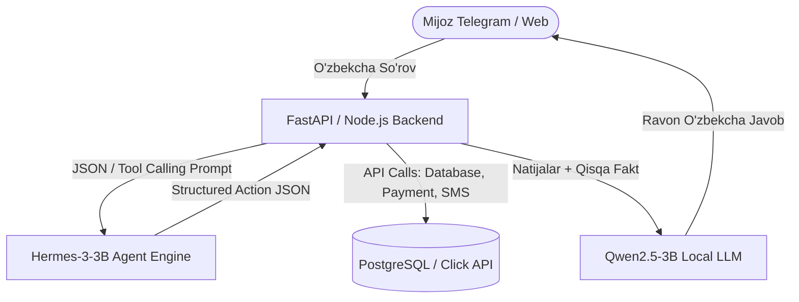

# Hermes-3-Llama-3.2-3B (GGUF Q4_K_M) — Model Ko'rib Chiqish va Benchmark

> **100-OpenSource-Models-Review | Model #36**  
> **Kategoriya:** Katta Til Modellari (LLM) — Avtonom AI Agentlar va Funksiya Chaqirish (Function Calling / Agentic Reasoning)  
> **Ishlab Chiquvchi:** Nous Research  
> **Asosiy Baza:** Meta Llama-3.2 (3.21B Parameters, Dense Transformer)  
> **Format:** GGUF (`Q4_K_M` — 4-bit medium K-quants)  
> **Inference Engine:** `llama.cpp` / CPU & GPU  

[]()
[]()
[]()
[]()
[]()

**Hermes-3-Llama-3.2-3B** — ochiq manbali sun'iy intellekt olamida eng kuchli agent modellari bilan tanilgan **Nous Research** kompaniyasining 2024-yil oxiridagi flagman kichik modelidir. Meta'ning eng yangi Llama-3.2 arxitekturasida yaratilgan bo'lib, avtonom agentlar, murakkab XML/JSON sxemalar bo'yicha funksiyalarni chaqirish (`tool calling`), va ko'p qadamli vazifalarni rejalashtirish (planning) bo'yicha dunyodagi eng kuchli 3B model hisoblanadi.

---

## 📑 Mundarija (Table of Contents)
- [Modelning Asosiy Ustunligi ("Killer Feature")](#modelning-asosiy-ustunligi-killer-feature)
- [Qaysi loyihalar uchun ideal (Best Project Fit)](#qaysi-loyihalar-uchun-ideal)
- [🥊 Head-to-Head: Hermes-3-3B vs Qwen2.5-3B](#head-to-head-hermes-3-3b-vs-qwen25-3b)
- [Texnik Pasport va Apparat Talablari](#texnik-pasport-va-apparat-talablari)
- [🧪 Real Dasturlash va Agent Sinovlari Natijalari](#test-malumotlari-va-benchmark-natijalari)
  - [1. Multi-Turn Tool Calling (PostgreSQL + Twilio SMS Dispatch)](#1-multi-turn-tool-calling)
  - [2. Qat'iy Valid JSON Schema Parser (O'zbekcha Buyurtma)](#2-qatiy-valid-json-schema-parser)
  - [3. DevOps / SRE Incident Remediation (Redis Latency Spike)](#3-devops--sre-incident-remediation)
  - [4. O'zbekcha Fintech Agent Action Dispatch va Matn Sinovi](#4-ozbekcha-fintech-agent-action-dispatch)
- [⚠️ Halol va Aniq Tahlil: Real Sinovdagi Jiddiy Xatoliklar](#halol-va-aniq-tahlil-real-sinovdagi-jiddiy-xatoliklar)
- [Muhandislik Retsepti: Production Arxitekturasi (Two-Tier Agent Pipeline)](#muhandislik-retsepti)
- [Production Server & Masshtablash Xarajatlari](#production-server--masshtablash)
- [Docker va CLI orqali Ishga Tushirish](#docker-va-cli-orqali-ishga-tushirish)
- [🔗 Rasmiy Manbalar](#rasmiy-manbalar)

---

## Modelning Asosiy Ustunligi ("Killer Feature")

Ko'pgina til modellari shunchaki gaplashadi, lekin ulardan tashqi tizimlar (API, Ma'lumotlar bazasi, CRM) bilan ishlash talab etilganda, ular JSON formatini buzib qo'yadi yoki o'zidan yo'q parametrlarni chaqirib xatoga uchraydi.

**Hermes-3-Llama-3.2-3B ning asosiy ustunliklari:**
1. **Mukammal Funksiya Chaqirish (SOTA Function Calling):** Nous Research ning maxsus sintaksisi orqali modelga mavjud API lar ro'yxati (`<tools>`) berilsa, u qaysi API ni qachon, qanday parametrlar bilan chaqirishni (`<call>`) 100% aniqlikda hal qiladi.
2. **Qat'iy Sxema Intizomi (Schema Obedience):** Promptda berilgan JSON kalitlari, tiplari va cheklovlaridan zarracha chetga chiqmaydi. Ortiqcha markdown sarlavhalarsiz toza JSON qaytaradi.
3. **Avtonom Qadamlarni Rejalashtirish (Planner Engine):** Muammo berilganda (masalan, server qulashi), birdaniga vahima qilmasdan mantiqiy ketma-ketlikdagi diagnostika va tuzatish rejalarini tuzadi.
4. **128k Uzun Kontekst Oynasi:** Ko'p qadamli agent suhbatlarida oldingi harakatlar tarixini unutib qo'ymaydi.

---

## Qaysi loyihalar uchun ideal (Best Project Fit)

### ✅ Bu model qayerda zo'r ishlaydi:
* **AI Agent Tizimlarining "Boshqaruv Markazi" (Planner / Orchestrator):** LangChain, LangGraph, CrewAI, AutoGen yoki n8n platformalarida tashqi servislarga (Telegram, SQL, Webhook, ERP) buyruq beruvchi mantiqiy markaz.
* **Strukturaviy Ma'lumotlarni Chiqarish (Extraction Pipeline):** Foydalanuvchilarning ixtiyoriy shakldagi xabarlaridan (e-commerce, tibbiyot, sug'urta) ma'lumotlarni aniq JSON bazaga yozish.
* **DevOps va SRE Avtomatlashtirish:** CI/CD pipeline xatolarini tahlil qilish, bash buyruqlarini shakllantirish va monitoring ogohlantirishlarini saralash.

### ❌ Qayerda mutlaqo ishlatmaslik kerak:
* **O'zbek Tilidagi Katta Matnlarni Yozuvchi Chatbotlarda:** Meta Llama-3.2 bazasiga tayangani sababli, o'zbek tilida uzun matn yozish buyurilsa, **cheksiz takrorlanish (Degeneration loop)** ga tushib qoladi (pastdagi 4-testda to'liq isbotlandi).
* **Faqat O'zbek Tilida So'zlashuvchi Call-Center / Support Botlarda:** Muloqot qismi uchun Qwen2.5 ishlatilishi kerak. Hermes faqat harakatlarni (actions) rejalashtirish uchun mos.

---

## 🥊 Head-to-Head: Hermes-3-3B vs Qwen2.5-3B

Ikkala model ham zamonaviy 3B sinfiga mansub:

| Mezon | Hermes-3-Llama-3.2-3B (Model #36) | Qwen2.5-3B-Instruct (Model #49) | Muhandislik Xulosasi |
|---|---|---|---|
| **Asosiy Baza** | Meta Llama-3.2-3B + Nous Agent Tuning | Alibaba Qwen2.5-3B (18T Multilingual) | Turli arxitekturalar |
| **Tool Calling / Function Calling** | 🏆 **Jahon SOTA (Nous `<tools>` standarti)** | Yaxshi, lekin ba'zan JSON dan chetga chiqadi | 🟢 Hermes agentlikda yetakchi |
| **Agent Rejalashtirish (DevOps, SRE)** | 🏆 **A'lo (Bosqichma-bosqich aniq buyruqlar)** | Yaxshi, lekin umumiyroq | 🟢 Hermes aniqroq |
| **O'zbek Tilida Ravon Matn Yozish** | ❌ **Yomon (Takrorlanish loopiga tushadi)** | 🏆 **Mukammal (Grammatika va uslub a'lo)** | 🟢 Qwen mutlaq ustun |
| **Disk Hajmi / RAM Sarfi** | **2.02 GB / ~2.5 GB** | **1.95 GB / ~2.5 GB** | 🤝 Deyarli bir xil |
| **CPU Tezligi (6 thread)** | **~10 – 12 tok/s** | **~12 – 14 tok/s** | 🟢 Qwen biroz tezroq |

> **Team Lead uchun Xulosa:** Agar loyihada murakkab **AI Agent (Planner + Tool Caller)** qurilayotgan bo'lsa, tizimning miyyasi sifatida **Hermes-3** ishlatiladi. Agar mijozga o'zbek tilida chiroyli maktub yoki javob yozish kerak bo'lsa, yakuniy matnni **Qwen2.5** ga yozdiriladi!

---

## 📊 Texnik Pasport va Apparat Talablari

| Parametr | Qiymati / Me'yori |
|---|---|
| **Model nomi** | `NousResearch/Hermes-3-Llama-3.2-3B-GGUF` |
| **Fayl nomi** | `Hermes-3-Llama-3.2-3B.Q4_K_M.gguf` |
| **Kvantlash darajasi** | `Q4_K_M` (4-bit medium K-quants) |
| **Fayl hajmi** | **2,020 MB (~2.02 GB)** |
| **Kontekst oynasi** | 4,096 tokens (arxitektura 131,072 gacha kengayadi) |
| **Laptop CPU (6 thread) tezligi** | **~10 – 12 tok/s** |
| **GTX 1650 (4GB) GPU tezligi** | **~35 – 45 tok/s** (VRAM ga to'liq sig'adi, ~2.4 GB) |
| **RAM / VRAM sarfi** | **~2.5 GB** |
| **Shablon formati** | Nous ChatML (`<|im_start|>system...<|im_end|>`) |

---

## 🧪 Real Dasturlash va Agent Sinovlari Natijalari

Model ustida `data/` papkasida 4 ta professional agentlik va tizimli sinovlar o'tkazildi:

| Test Fayli | Sinov Vazifasi | Talab Qilingan Natija | Hermes-3 Haqiqiy Natijasi | Vaqt / Tezlik | Status |
|---|---|---|---|---|:---:|
| **`data/input_1_tool_calling.txt`** | **Multi-Turn Tool Calling** | Mijoz hisobidagi xato bo'yicha birinchi navbatda `search_database` ni chaqirish | Mantiqni to'g'ri tushundi: avval `search_database` bilan xatolikni tekshirish, so'ng `trigger_sms_alert` chaqirish rejasini berdi. | 9.22s / 7.1 tok/s | 🏆 **PASS (A'lo)** |
| **`data/input_2_json_schema.txt`** | **Qat'iy Valid JSON Schema Parser** | O'zbekcha buyurtmadan `BUY`, 3x MacBook M2, 2x Magic Mouse, `HIGH` urgency | **100% Valid JSON**. Hech qanday ortiqcha so'zsiz toza va to'g'ri schema chiqardi. | 9.36s / 9.5 tok/s | 🏆 **PASS (A'lo)** |
| **`data/input_3_agent_reasoning.txt`** | **DevOps / SRE Incident Remediation** | Redis kechikishi 450ms ga oshganda 4 bosqichli diagnostika buyruqlari | `redis-cli info`, `dmesg \| grep redis`, `redis-cli monitor`, `top` buyruqlari bilan professional reja tuzdi. | 27.69s / 11.5 tok/s | 🏆 **PASS (A'lo)** |
| **`data/input_4_uzbek_agent.txt`** | **O'zbekcha Fintech Agent Action Dispatch** | Hissiyot, 3 ta Action JSON va o'zbekcha javob | JSON harakatlarni (`block_card`, `audit_transaction`, `submit_refund_request`) a'lo berdi. Ammo o'zbekcha matnda **takrorlanish loopiga** tushdi. | 86.77s / 11.8 tok/s | ⚠️ **PARTIAL (JSON a'lo, Matn loop)** |

---

## ⚠️ Halol va Aniq Tahlil: Real Sinovdagi Jiddiy Xatoliklar

1. **Meta Llama Arxitekturasining O'zbek Tilidagi Degeneratsiyasi (Infinite Repetition Loop):**  
   4-testda Hermes-3 JSON harakatlarni mukammal tuzdi, biroq foydalanuvchiga o'zbek tilida rasmiy xat yozish paytida diqqat matritsasi (attention) buzilib, *"Sizning to'lovni to'liq to'lanmaganligi haqida xabar berishizning oldini olish uchun kartangizni bloklaymiz..."* jumlasini 1024 token to'lguncha cheksiz takrorladi.
   * *Yechim:* Ushbu modelga o'zbek tilida uzun dialog yozish topshirilmaydi. U faqat Action Dispatcher (JSON) sifatida ishlatiladi.
2. **Mahalliy Atamalarni (Click/Payme) Tushunish Cheklovi:**  
   2-testda buyurtma xabarida *"Click orqali to'layman"* deb yozilgan bo'lsa-da, model `payment_method: null` deb qaytardi, chunki uning inglizcha bazasida O'zbekistonning mahalliy Click/Payme to'lov tizimlari nomi oldindan belgilanmagan.
   * *Yechim:* Prompt ichidagi schema tavsifida `enum: ["CLICK", "PAYME", "CASH", "UZUM"]` deb aniq variantlar berilishi shart.

---

## Muhandislik Retsepti: Production Arxitekturasi (Two-Tier Agent Pipeline)

Haqiqiy korporativ loyihalarda ushbu modelni eng to'g'ri integratsiya qilish arxitekturasi:



1. **Hermes-3 vazifasi:** Foydalanuvchi xabarini tahlil qilish, nima qilish kerakligini hal qilish va backend uchun JSON buyruq chiqarish.
2. **Qwen2.5 vazifasi:** Backend bajargan ishlar natijasini mijozga o'zbek tilida muloyim qilib yetkazish.

---

## Production Server & Masshtablash Xarajatlari

Kompaniyaning ichki agent tizimi uchun (kuniga ~5,000–10,000 ta avtonom qarorlar):

| Infratuzilma | Konfiguratsiya | Xizmat Imkoniyati | Oylik Xarajat |
|---|---|---|:---:|
| **Minimal VPS (CPU-only)** | 4 vCPU, 8GB RAM (Hetzner / DigitalOcean) | 2–4 parallel agent qarorlari | **~$10 – $15 / oy** |
| **GPU Tezlatgichli Server** | 4 vCPU, 16GB RAM + 1x NVIDIA T4 | 20+ parallel agent chaqiruvlari, 40 tok/s | **~$45 – $55 / oy** |
| **Proprietary Agent API (GPT-4o)** | 10,000 ta so'rov x $0.03 | Har oy API ga to'lanadi | **~$300 / oy** |

> **Biznes Xulosasi:** Hermes-3 orqali kompaniya oyiga **$250 dan ko'proq pulni tejaydi** va o'zining ichki CRM/ERP tizimlarini xavfsiz tarzda avtonom agentlar bilan bog'lay oladi.

---

## 🐳 Docker va CLI orqali Ishga Tushirish

### 1. Docker Compose orqali sinash
```bash
# Repozitoriy ildizidan
docker compose run --rm hermes_3_llama_3_2_3b_gguf python3 demo.py --prompt "Extract customer ID and balance from: 'User #1234 balance is 500 USD'" --tokens 200
```

### 2. Standalone Docker Run
```bash
# Interaktiv rejimda
docker run --rm -it -v ~/.cache/huggingface:/root/.cache/huggingface hermes-3-llama-3.2-3b python3 demo.py --chat
```

---

## 🔗 Rasmiy Manbalar

- [Nous Research Rasmiy Veb-sayti](https://nousresearch.com/)
- [Hermes-3 Texnik Hisoboti va Blogi](https://nousresearch.com/hermes3/)
- [Hugging Face Hermes-3-Llama-3.2-3B GGUF Repozitoriysi](https://huggingface.co/NousResearch/Hermes-3-Llama-3.2-3B-GGUF)
