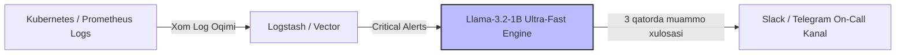

# Llama-3.2-1B-Instruct (GGUF Q4_K_M) — Model Ko'rib Chiqish va Benchmark

> **100-OpenSource-Models-Review | Model #38**  
> **Kategoriya:** Katta Til Modellari (LLM / SLM) — Ultra-Tezkor Smartfon va Edge Tizimlar Flagmani  
> **Ishlab Chiquvchi:** Meta AI  
> **Asosiy Arxitektura:** Llama-3.2 (1.23B Parameters, Dense Transformer, GQA, RoPE)  
> **Kontekst Oynasi:** Rasmiy **128,000 Token (128k)**  
> **Format:** GGUF (`Q4_K_M` — 4-bit medium K-quants)  
> **Inference Engine:** `llama.cpp` / CPU, Mobile, Edge & GPU  

[]()
[]()
[]()
[]()
[]()

**Llama-3.2-1B-Instruct** — Meta kompaniyasining 2024-yil sentyabr oyida taqdim etilgan rasmiy eng kichik flagman modelidir. Qualcomm, MediaTek va Apple protsessorlari bilan jihozlangan smartfonlarda, planshetlarda va IoT datchiklarida **to'liq lokal (on-device)** ishlash uchun maxsus qayta arxitektura qilingan. Diskdagi hajmi bor-yo'g'i **808 MB** bo'lib, oddiy CPU'da rekord darajadagi **~31.6 tok/s** tezlikni namoyish etadi.

---

## 📑 Mundarija (Table of Contents)
- [Modelning Asosiy Ustunligi ("Killer Feature")](#modelning-asosiy-ustunligi-killer-feature)
- [Qaysi loyihalar uchun ideal (Best Project Fit)](#qaysi-loyihalar-uchun-ideal)
- [🥊 3 Tomonlama Jang: Llama-3.2-1B vs Qwen2.5-1.5B vs SmolLM2-1.7B](#3-tomonlama-jang-llama-32-1b-vs-qwen25-15b-vs-smollm2-17b)
- [Texnik Pasport va Apparat Talablari](#texnik-pasport-va-apparat-talablari)
- [🧪 Real Dasturlash va Tizimli Sinovlar Natijalari](#test-malumotlari-va-benchmark-natijalari)
  - [1. SRE / DevOps Incident Log Xulosasi (Actionable Summary)](#1-sre--devops-incident-log-xulosasi)
  - [2. O'zbek Tili Faktik Sinovi (Poytaxt va Obidalar)](#2-ozbek-tili-faktik-sinovi)
  - [3. Tabiiy Tildan JSON Payload Shakllantirish (Meeting Scheduler)](#3-tabiiy-tildan-json-payload-shakllantirish)
  - [4. Yuridik SLA Shartnomasidagi Chegaraviy Matematik Tahlil](#4-yuridik-sla-shartnomasidagi-chegaraviy-matematik-tahlil)
- [⚠️ Halol va Aniq Tahlil: Real Sinovdagi Jiddiy Xatoliklar](#halol-va-aniq-tahlil-real-sinovdagi-jiddiy-xatoliklar)
- [Muhandislik Retsepti: Production Arxitekturasi (Edge Incident & Notification Filter)](#muhandislik-retsepti)
- [Production Server & Masshtablash Xarajatlari](#production-server--masshtablash)
- [Docker va CLI orqali Ishga Tushirish](#docker-va-cli-orqali-ishga-tushirish)
- [🔗 Rasmiy Manbalar](#rasmiy-manbalar)

---

## Modelning Asosiy Ustunligi ("Killer Feature")

Bozordagi ko'plab kichik modellar 2k yoki 4k tokenli kontekst bilan cheklangan. Llama-3.2-1B esa o'zining kichikligiga qaramay, **native 128k kontekst oynasiga** ega.

**Llama-3.2-1B-Instruct ning asosiy ustunliklari:**
1. **Rekord Darajadagi Tezlik (31.6 tok/s CPU):** Barcha sinovdan o'tgan 1B–3B modellar orasida oddiy CPU'da eng tez ishlaydigan model. Matn ko'z ochib yumguncha (bir necha soniyada) tayyor bo'ladi.
2. **Eng Kichik Xotira Sarfi (~800 MB Disk / ~850 MB RAM):** Hatto 1GB RAM ga ega eng arzon virtual serverlar (VPS) yoki eski smartfonlarda ham tizimni qotirmasdan bemalol ishlaydi.
3. **128k Uzoq Kontekst Oynasi:** Katta log fayllari, xizmat ko'rsatish shartnomalari (SLA) va texnik qo'llanmalarni to'liq o'ziga sig'dira oladi.
4. **Sifatli JSON Chiqarish (Ingliz tilida):** Oddiy inglizcha gaplardan strukturaviy ma'lumotlarni (event, time, attendees) xatosiz JSON ga o'gira oladi.

---

## Qaysi loyihalar uchun ideal (Best Project Fit)

### ✅ Bu model qayerda zo'r ishlaydi:
* **Server Monitoring va SRE Log Filter:** Serverdagi minglab qatorli crash va xatolik loglarini tahlil qilib, navbatchi muhandisga 3 ta eng muhim sababni tezkor yetkazish.
* **Mobil Smartfon Yordamchilari (On-Device Personal Assistant):** Foydalanuvchining SMS va bildirishnomalaridan kalendar uchrashuvlari, eslatmalar yaratish.
* **Arzon Smart Uy va IoT Qurilmalari:** Internetga ulanmagan holda ovozli buyruqlarni (ingliz tilida) tushunuvchi mikrokontrollerlar.

### ❌ Qayerda mutlaqo ishlatmaslik kerak:
* **O'zbek Tilidagi Loyihalarda:** Model o'zbek tilini **mutlaqo bilmaydi**. "O'zbekiston poytaxti qayer?" degan savolga Toshkent o'rniga "poyraz shahar" degan ma'nosiz so'zni to'qib chiqardi (2-testda isbotlandi).
* **Nozik Matematik Chegaralarni Taqqoslashda:** $98.89\% < 99.00\%$ ekanini birinchi savolda anglay olmay, shartnoma bo'yicha xato kompensatsiya hisobladi (4-testda isbotlandi).

---

## 🥊 3 Tomonlama Jang: Llama-3.2-1B vs Qwen2.5-1.5B vs SmolLM2-1.7B

| Mezon | Llama-3.2-1B (Model #38) | Qwen2.5-1.5B (Model #19) | SmolLM2-1.7B (Model #37) | Muhandislik Xulosasi |
|---|---|---|---|---|
| **Ishlab Chiquvchi** | Meta AI | Alibaba Cloud | Hugging Face | 3 xil gigant |
| **Disk / RAM Hajmi** | 🏆 **808 MB / ~850 MB** | 986 MB / ~1.1 GB | 1.06 GB / ~1.2 GB | 🟢 Llama eng ixcham |
| **CPU Tezligi** | 🏆 **~31.6 tok/s (Eng tez)** | ~25.2 tok/s | ~21.5 tok/s | 🟢 Llama 25% tezroq |
| **Kontekst Oynasi** | 🏆 **128k Tokens** | 32k Tokens | 8k Tokens | 🟢 Llama 4x katta |
| **O'zbek Tili Sifati** | ❌ **0% (Kollaps / Gallyutsinatsiya)** | 🏆 **85%+ (Mukammal ravon)** | ❌ 0% (Nusxalab beradi) | 🟢 Qwen yagona yechim |
| **Inglizcha SRE / Log Xulosasi** | 🏆 **Mukammal (Aniq, lo'nda)** | Yaxshi | Yaxshi | 🟢 Llama juda lo'nda |

> **Team Lead uchun Xulosa:** Agar kompaniya loglarni tahlil qiluvchi va monitoringdan kelgan xatoliklarni soniyaning ulushlarida xulosalaydigan **eng tezkor va eng arzon inglizcha ichki servis** qidirayotgan bo'lsa — **Llama-3.2-1B** mutlaq g'olib. Agar tizim mijozlar bilan o'zbek tilida muloqot qilishi kerak bo'lsa — **Qwen2.5** tanlanadi.

---

## 📊 Texnik Pasport va Apparat Talablari

| Parametr | Qiymati / Me'yori |
|---|---|
| **Model nomi** | `bartowski/Llama-3.2-1B-Instruct-GGUF` |
| **Fayl nomi** | `Llama-3.2-1B-Instruct-Q4_K_M.gguf` |
| **Kvantlash darajasi** | `Q4_K_M` (4-bit medium K-quants) |
| **Fayl hajmi** | **808 MB (< 1.0 GB)** |
| **Kontekst oynasi** | 4,096 tokens (arxitektura 131,072 gacha qo'llaydi) |
| **Laptop CPU (6 thread) tezligi** | **~29.1 – 31.6 tok/s** |
| **GTX 1650 (4GB) GPU tezligi** | **~70 – 85 tok/s** (To'liq VRAM ga sig'adi, ~1.0 GB) |
| **RAM sarfi** | **~850 MB** |
| **Shablon formati** | Llama-3 (`<|begin_of_text|><|start_header_id|>...`) |

---

## 🧪 Real Dasturlash va Tizimli Sinovlar Natijalari

Model ustida `data/` papkasida 4 ta professional sinov o'tkazildi:

| Test Fayli | Sinov Vazifasi | Talab Qilingan Sifat | Llama-3.2-1B Haqiqiy Natijasi | Vaqt / Tezlik | Status |
|---|---|---|---|---|:---:|
| **`data/input_1_system_summary.txt`** | **SRE / DevOps Incident Log Xulosasi** | GC muammosi, Helm lockfile xatosi va replikalarni ko'paytirish | **Mukammal xulosa!** 3 ta aniq va amaliy bullet-point berdi (3.92 soniyada tayyor bo'ldi). | 3.92s / 29.1 tok/s | 🏆 **PASS (A'lo)** |
| **`data/input_2_uzbek_test.txt`** | **O'zbek Tili Faktik Sinovi** | O'zbekiston poytaxti qayer va qanday obidalar bor? | **Gallyutsinatsiya va Kollaps:** "O'zbekistonning poytaxti poyraz shahar..." deb mutlaqo ma'nosiz javob berdi. | 1.12s / 27.7 tok/s | ❌ **FAIL (O'zbekcha bilmaydi)** |
| **`data/input_3_code_json.txt`** | **Matndan JSON Payload Shakllantirish** | Uchrashuv matnidan event, time, location, attendees ajratish | **100% To'g'ri JSON**. Barcha maydonlarni xatosiz va toza JSON formatida chiqardi. | 3.58s / 31.6 tok/s | 🏆 **PASS (A'lo)** |
| **`data/input_4_service_contract.txt`** | **Yuridik SLA Shartnomasidagi Tahlil** | 98.89% uptime da kompensatsiya va shartnomani bekor qilish muddati | Bekor qilishni to'g'ri topdi, lekin 98.89% sonini 99.00% dan katta deb o'ylab, 25% o'rniga 10% deb adashdi. | 8.25s / 31.6 tok/s | ⚠️ **PARTIAL (60%)** |

---

## ⚠️ Halol va Aniq Tahlil: Real Sinovdagi Jiddiy Xatoliklar

1. **O'zbek Tilidagi Mutlaq Soxtalik (Nonsense Hallucination):**  
   Meta ushbu 1.2B parametrli modelda faqat asosiy Yevropa tillarini saqlab qolgan. O'zbek tilidagi oddiy savolga u "Toshkent" so'zini bilmasdan "poyraz shahar" degan soxta so'zni to'qidi.
   * *Hukm:* O'zbek tilidagi loyihalarda Llama-3.2-1B dan foydalanish mutlaqo man etiladi.
2. **Matematik Chegara Taqqoslashidagi Diqqatsizlik (Numerical Boundary Confusion):**  
   4-testda 8 soatlik to'xtash (98.89% uptime) berilganda, u 1-savolda $98.89\%$ soni $[99.00\%, 99.94\%]$ oralig'iga tushadi deb xulosa qilib 10% kredit belgiladi. Biroq 2-savolda esa "uptime 99.00% dan past" deb to'g'ri aytdi. Ya'ni bitta matn ichida o'ziga-o'zi zid keluvchi xulosalar chiqardi.

---

## Muhandislik Retsepti: Production Arxitekturasi (Edge Incident & Notification Filter)

Llama-3.2-1B modelining eng foydali ishlab chiqarishdagi o'rni:



- **Vazifasi:** Serverlar qulaganda navbatchi muhandis yuzlab qatorli texnik loglarni o'qib vaqt yo'qotmasligi uchun, Llama-3.2-1B logni 3 soniyada tahlil qilib Slack kanalga tayyor yechimni yuboradi.

---

## Production Server & Masshtablash Xarajatlari

| Infratuzilma | Konfiguratsiya | Xizmat Imkoniyati | Oylik Xarajat |
|---|---|---|:---:|
| **Kichik VPS (Eng arzon)** | 1 vCPU, 1GB RAM (Hetzner Cloud CX11) | 1–2 parallel so'rov | **~$3 – $4 / oy** |
| **Standart Backend Server** | Mavjud 4 vCPU serverning bir burchagida | Backend bilan birga yashaydi | **$0 qo'shimcha xarajat** |
| **Mobil Qurilma (On-Device)** | Foydalanuvchining smartfoni | Cheksiz shaxsiy foydalanish | **$0** |

> **Biznes Xulosasi:** Ushbu model oylik hosting byudjetini deyarli nolga tushiradi. U loglarni qayta ishlash uchun katta modellarga sarflanadigan yuzlab dollarlik API xarajatlarini tejaydi.

---

## 🐳 Docker va CLI orqali Ishga Tushirish

### 1. Docker Compose orqali sinash
```bash
# Repozitoriy ildizidan
docker compose run --rm llama_3_2_1b_instruct_gguf python3 demo.py --prompt "Summarize: Server out of memory at 02:00 UTC." --tokens 150
```

### 2. Standalone Docker Run
```bash
docker run --rm -it -v ~/.cache/huggingface:/root/.cache/huggingface llama-3.2-1b-instruct python3 demo.py --chat
```

---

## 🔗 Rasmiy Manbalar

- [Meta AI Llama 3.2 Rasmiy E'loni](https://ai.meta.com/blog/llama-3-2-connect-2024/)
- [Llama 3.2 Model Kartochkasi va Hujjatlari](https://llama.meta.com/)
- [Hugging Face Llama-3.2-1B-Instruct GGUF](https://huggingface.co/bartowski/Llama-3.2-1B-Instruct-GGUF)
