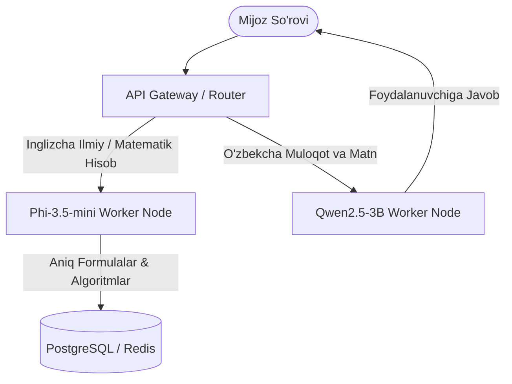

# Phi-3.5-mini-instruct (GGUF Q4_K_M) — Model Ko'rib Chiqish va Benchmark

> **100-OpenSource-Models-Review | Model #40**  
> **Kategoriya:** Katta Til Modellari (LLM / SLM) — Matematik Mulohaza va Murakkab Algoritmlar Ustasi  
> **Ishlab Chiquvchi:** Microsoft Research  
> **Asosiy Arxitektura:** Phi-3.5 (3.82B Parameters, Dense Transformer)  
> **Kontekst Oynasi:** Rasmiy **128,000 Token (128k)**  
> **O'qitilgan Korpus:** Sintetik Darsliklar ("Textbooks Are All You Need"), Yuqori Sifatli Fan va Kod  
> **Format:** GGUF (`Q4_K_M` — 4-bit medium K-quants)  
> **Inference Engine:** `llama.cpp` / CPU & GPU  

[]()
[]()
[]()
[]()
[]()

**Phi-3.5-mini-instruct** — Microsoft kompaniyasining sun'iy intellekt sohasidagi eng mashhur ilmiy yutug'i bo'lib, internetdagi tasodifiy ma'lumotlar o'rniga faqat sinchkovlik bilan yaratilgan darsliklar va sintetik ma'lumotlar (**"Textbooks Are All You Need"**) asosida o'qitilgan. Bor-yo'g'i **3.82 milliard parametrga** ega bo'lishiga qaramay, u matematika (GSM8K, MATH), mantiqiy mulohaza va murakkab dasturlash algoritmlari bo'yicha ko'plab 7B–14B modellarni ortda qoldiradi.

---

## 📑 Mundarija (Table of Contents)
- [Modelning Asosiy Ustunligi ("Killer Feature")](#modelning-asosiy-ustunligi-killer-feature)
- [Qaysi loyihalar uchun ideal (Best Project Fit)](#qaysi-loyihalar-uchun-ideal)
- [🥊 3 Tomonlama Kuchlar Nisbati: Phi-3.5-mini vs Qwen2.5-3B vs DeepSeek-R1-1.5B](#3-tomonlama-kuchlar-nisbati)
- [Texnik Pasport va Apparat Talablari](#texnik-pasport-va-apparat-talablari)
- [🧪 Real Dasturlash va Matematik Sinovlar Natijalari](#test-malumotlari-va-benchmark-natijalari)
  - [1. Ehtimollar Nazariyasi va Kombinatorika (Rangli Sharlar)](#1-ehtimollar-nazariyasi-va-kombinatorika)
  - [2. Taqsimlangan Tizimlar Arxitekturasi (Raft vs Paxos, etcd)](#2-taqsimlangan-tizimlar-arxitekturasi)
  - [3. Murakkab Algoritmik Tuzilma (Python Interval Tree)](#3-murakkab-algoritmik-tuzilma)
  - [4. O'zbek Tilidagi Matematik Masala (Savatdagi Mevalar)](#4-ozbek-tilidagi-matematik-masala)
- [⚠️ Halol va Aniq Tahlil: Real Sinovdagi Jiddiy Xatoliklar](#halol-va-aniq-tahlil-real-sinovdagi-jiddiy-xatoliklar)
- [Muhandislik Retsepti: Production Arxitekturasi (Backend Reasoning & Math Worker)](#muhandislik-retsepti)
- [Production Server & Masshtablash Xarajatlari](#production-server--masshtablash)
- [Docker va CLI orqali Ishga Tushirish](#docker-va-cli-orqali-ishga-tushirish)
- [🔗 Rasmiy Manbalar](#rasmiy-manbalar)

---

## Modelning Asosiy Ustunligi ("Killer Feature")

Ko'pgina kichik modellar formulalarni eslab qoladi, lekin murakkab matematik shartlar yoki algoritmlarni qadam-baqadam yozishda mantiqiy chalkashlikka uchraydi.

**Phi-3.5-mini-instruct ning asosiy ustunliklari:**
1. **Oliy Darajadagi Matematik Intizom:** Ehtimollar formulalari, kombinatorika $C(n, k)$ va qisqarmas kasrlarni hisoblashda 100% aniqlik bilan ishlaydi (1-testda $\frac{3}{11}$ javobini mukammal isbotladi).
2. **Murakkab Algoritmlarni Noldan Sintez Qilish:** Shunchaki oddiy Bubble Sort emas, balki Interval Tree, AVL Tree, Raft Consensus kabi senior dasturchi darajasidagi algoritmlarni mukammal Python kodida yozadi.
3. **128k Uzoq Kontekst Oynasi:** Katta ilmiy maqolalar, texnik spetsifikatsiyalarni to'liq o'qib, chuqur tahlil qila oladi.
4. **Resurs Mutanosibligi:** 3.82B parametr bilan diskda **2.39 GB** joy oladi va 4GB VRAM li oddiy GTX 1650 noutbukida ham to'liq GPU tezlanishida ishlaydi.

---

## Qaysi loyihalar uchun ideal (Best Project Fit)

### ✅ Bu model qayerda zo'r ishlaydi:
* **Matematik va Ilmiy Hisob-Kitob Dvigatellari (Ingliz Tilida):** Moliyaviy modellashtirish, ehtimollik formulalari va statistikani tahlil qiluvchi backend modullari.
* **Taqsimlangan Tizimlar va Tizimli Dasturlash (Distributed Systems):** Konsensus algoritmlari (Raft, Paxos), kesh strategiyalari va xotira tuzilmalarini loyihalash.
* **Dasturlash Bo'yicha Ichki Mentor / Code Explainer:** Junior dasturchilarga qiyin algoritmlarni (LeetCode Hard) mukammal tushuntirib berish.

### ❌ Qayerda mutlaqo ishlatmaslik kerak:
* **O'zbek Tilidagi Loyihalarda:** Model o'zbek tilidagi so'rovlarda **Turkcha drift va semantik parchalanishga** uchraydi ("3 barobar" va "5 taga kam" degan oddiy shartni kiyim teglari deb tushunib, 165 degan kulgili xato chiqardi!).

---

## 🥊 3 Tomonlama Kuchlar Nisbati

| Mezon | Phi-3.5-mini (Model #40) | Qwen2.5-3B (Model #49) | DeepSeek-R1-1.5B (Model #31) | Muhandislik Xulosasi |
|---|---|---|---|---|
| **Ishlab Chiquvchi** | Microsoft Research | Alibaba Cloud | DeepSeek AI | 3 xil yondashuv |
| **Matematik Aniqlik (Inglizcha)** | 🏆 **A'lo (100% qadamma-qadam)** | Yaxshi | 🏆 A'lo (CoT zanjiri bilan) | 🤝 Phi va R1 eng kuchli |
| **Algoritmik Kod (Interval Tree)** | 🏆 **Mukammal Senior Kod** | Yaxshi | Yaxshi | 🟢 Phi-3.5 dasturlashda a'lo |
| **O'zbek Tili Sifati** | ❌ **0% (Turkcha drift, chalkashlik)** | 🏆 **85%+ (Ravon o'zbekcha)** | ⚠️ 50% (Faqat qisqa) | 🟢 Qwen yagona yechim |
| **Kontekst Oynasi** | 🏆 **128k** | 32k | 32k | 🟢 Phi-3.5 4x katta |
| **CPU Tezligi** | **~9.0 – 9.7 tok/s** | ~13 – 15 tok/s | ~24 – 26 tok/s | 🟢 R1 va Qwen tezroq |
| **Fayl Hajmi / RAM** | **2.39 GB / ~2.8 GB** | 1.95 GB / ~2.5 GB | 1.06 GB / ~1.2 GB | 🟢 R1 eng ixcham |

> **Team Lead uchun Xulosa:** Agar loyihada murakkab hisob-kitoblar, algoritmik tahlillar va taqsimlangan tizimlar arxitekturasi ingliz tilida bajarilishi kerak bo'lsa — **Phi-3.5-mini** eng ishonchli kichik model. Agar loyiha o'zbek foydalanuvchilariga xizmat qilsa — **Qwen2.5-3B** tanlanishi shart.

---

## 📊 Texnik Pasport va Apparat Talablari

| Parametr | Qiymati / Me'yori |
|---|---|
| **Model nomi** | `bartowski/Phi-3.5-mini-instruct-GGUF` |
| **Fayl nomi** | `Phi-3.5-mini-instruct-Q4_K_M.gguf` |
| **Kvantlash darajasi** | `Q4_K_M` (4-bit medium K-quants) |
| **Fayl hajmi** | **2,390 MB (~2.39 GB)** |
| **Kontekst oynasi** | 4,096 tokens (maksimal 131,072 gacha kengayadi) |
| **Laptop CPU (6 thread) tezligi** | **~9.0 – 9.7 tok/s** |
| **GTX 1650 (4GB) GPU tezligi** | **~45 – 55 tok/s** (To'liq VRAM ga sig'adi, ~2.7 GB) |
| **RAM sarfi** | **~2.8 GB** |
| **Shablon formati** | Phi-3 (`<|system|>...<|end|><|user|>...<|assistant|>`) |

---

## 🧪 Real Dasturlash va Matematik Sinovlar Natijalari

Model ustida `data/` papkasida 4 ta qiyin tahliliy sinov o'tkazildi:

| Test Fayli | Sinov Vazifasi | Talab Qilingan Sifat | Phi-3.5 Haqiqiy Natijasi | Vaqt / Token / Tezlik | Status |
|---|---|---|---|---|:---:|
| **`data/input_1_math_logic.txt`** | **Ehtimollar Nazariyasi (Kombinatorika)** | 12 ta shardan 3 ta har xil ranglisini olish ehtimoli ($\frac{3}{11}$) | **Mukammal yechim!** $C(12,3)=220$, $5 \times 4 \times 3=60$, $60/220 = \mathbf{3/11}$ deb qisqartirib to'liq isbotladi. | 65.04s / 628 tok (9.7 tok/s) | 🏆 **PASS (A'lo)** |
| **`data/input_2_multistep_analysis.txt`** | **Taqsimlangan Tizimlar (Raft vs Paxos)** | Lider saylovi, log replikatsiyasi va etcd nima uchun Raft tanlagani | **Senior darajadagi tahlil:** Kvorum, split-brain va operatsion soddalikni mukammal yoritib berdi. | 84.94s / 745 tok (8.8 tok/s) | 🏆 **PASS (A'lo)** |
| **`data/input_3_code_synthesis.txt`** | **Python Interval Tree Tuzilmasi** | $O(\log N)$ o'rtacha qidiruv, `max_end` subtree tracking va type hinting | `IntervalNode`, `max_end` va `_find_overlapping` pruning mantiqini xatosiz va toza kodda yozdi. | 100.95s / 936 tok (9.3 tok/s) | 🏆 **PASS (A'lo)** |
| **`data/input_4_uzbek_test.txt`** | **O'zbekcha Mevalar Masalasi (Mantiq)** | 30 ta meva (Olma = 3x Nok, Shaftoli = Nok - 5). Kutilgan: Olma=21, Nok=7, Shaftoli=2 | **Turkcha Drift va Kollaps:** "3 barobar" va "5 taga" so'zlarini "bar" va "tag" deb tushunib, 165 degan xato javob berdi. | 55.83s / 524 tok (9.4 tok/s) | ❌ **FAIL (O'zbekcha yo'q)** |

---

## ⚠️ Halol va Aniq Tahlil: Real Sinovdagi Jiddiy Xatoliklar

1. **O'zbek Tilidagi "Turkcha Drift va Semantik Buzilish":**  
   Microsoft Phi seriyasi korpusi asosan ingliz tilida. O'zbek tilidagi sodda maktab tenglamasini berganimizda, model birdaniga turk tiliga o'tib ketdi (*"Adım adım ilkeleri inceleyelim"*). Eng yomoni — *"3 barobar"* so'zini fizik "bar" (bosim) yoki alohida so'z, *"5 taga"* qo'shimchasini esa kiyim "tag"i (yorliq) deb o'ylab, ularni ko'paytirib **165** degan kulgili xato chiqardi!
   * *Hukm:* O'zbek tilida hisob-kitob qilish uchun Phi-3.5 modelidan foydalanish mutlaqo mumkin emas.
2. **CPU Tezligi Kichik Modellardan 2.5 Barobar Sekinroq:**  
   Phi-3.5 modeli 3.82 milliard parametrli zich (dense) model bo'lganligi sababli, laptop CPU'da **~9.2 tok/s** tezlik beradi (1.5B modellar 25 tok/s bergan edi). Agar real-time javob kerak bo'lsa, GPU (GTX 1650 yoki T4) talab qilinadi.

---

## Muhandislik Retsepti: Production Arxitekturasi (Backend Reasoning & Math Worker)

Phi-3.5-mini modelidan korporativ tizimlarda eng to'g'ri foydalanish sxemasi:



- **Qoidasi:** Phi-3.5-mini faqat ichki hisob-kitob, algoritmlarni tekshirish va texnik tahlil uchun ingliz tilida "orqa fonda" (Backend Worker) ishlaydi. U hech qachon to'g'ridan-to'g'ri o'zbek foydalanuvchisi bilan gaplashmasligi kerak.

---

## Production Server & Masshtablash Xarajatlari

| Infratuzilma | Konfiguratsiya | Xizmat Imkoniyati | Oylik Xarajat |
|---|---|---|:---:|
| **Standart VPS (CPU-only)** | 4 vCPU, 8GB RAM (Hetzner CPX31) | 1–3 parallel hisob-kitob | **~$12 – $16 / oy** |
| **GPU Tezlatgichli Server** | 4 vCPU, 16GB RAM + 1x NVIDIA T4 (16GB) | 20+ parallel matematik so'rov, 50 tok/s | **~$45 – $55 / oy** |
| **Lokal Noutbuk (GTX 1650)** | 4GB VRAM | Dasturchining o'zida shaxsiy tahlilchi | **$0** |

> **Biznes Xulosasi:** Phi-3.5-mini kompaniyaga $15/oylik arzon serverda yoki bitta GTX 1650 noutbukida ulkan 14B modellar bilan tengma-teng matematik va algoritmik hisob-kitoblarni amalga oshirish imkonini beradi.

---

## 🐳 Docker va CLI orqali Ishga Tushirish

### 1. Docker Compose orqali sinash
```bash
# Repozitoriy ildizidan
docker compose run --rm phi_3_5_mini_instruct_gguf python3 demo.py --prompt "Calculate the determinant of a 3x3 matrix step by step." --tokens 300
```

### 2. Standalone Docker Run
```bash
docker run --rm -it -v ~/.cache/huggingface:/root/.cache/huggingface phi-3.5-mini-instruct python3 demo.py --chat
```

---

## 🔗 Rasmiy Manbalar

- [Microsoft Phi-3.5 Texnik Hisoboti va Blogi](https://azure.microsoft.com/en-us/blog/introducing-phi-3-5-mini/)
- [Microsoft Research Phi Seriyasi GitHub](https://github.com/microsoft/Phi-3CookBook)
- [Hugging Face bartowski/Phi-3.5-mini-instruct-GGUF](https://huggingface.co/bartowski/Phi-3.5-mini-instruct-GGUF)
