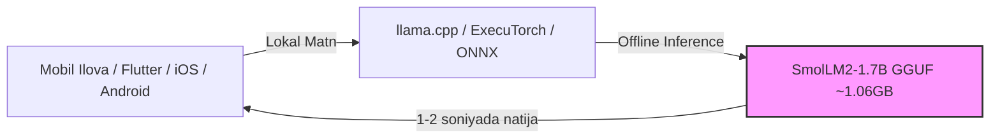

# SmolLM2-1.7B-Instruct (GGUF Q4_K_M) — Model Ko'rib Chiqish va Benchmark

> **100-OpenSource-Models-Review | Model #37**  
> **Kategoriya:** Katta Til Modellari (LLM / SLM) — Ultra-Ixcham Mobil va Edge Til Modeli  
> **Ishlab Chiquvchi:** Hugging Face TB (SmolLM Tashabbusi)  
> **Asosiy Baza:** 11 Trillion Tokenlik Oliy Sifatli Sintetik va Ta'lim Korpusi (FineWeb-Edu, Cosmopedia v2)  
> **Format:** GGUF (`Q4_K_M` — 4-bit medium K-quants)  
> **Inference Engine:** `llama.cpp` / CPU, Mobile & Edge  

[]()
[]()
[]()
[]()
[]()

**SmolLM2-1.7B-Instruct** — Hugging Face kompaniyasining ixcham va aqlli sun'iy intellekt modellarini (Small Language Models) yaratish bo'yicha eng ilg'or ilmiy ishlanmasidir. Model umumiy **11 trillion tokenlik** eng toza ma'lumotlar to'plamida (ta'limiy FineWeb-Edu, Cosmopedia v2 sintetik darsliklari va Python kodlari) o'qitilgan bo'lib, smartfonlar, planshetlar, IoT qurilmalari (Raspberry Pi) va brauzer ichida to'g'ridan-to'g'ri ishlash uchun mo'ljallangan.

---

## 📑 Mundarija (Table of Contents)
- [Modelning Asosiy Ustunligi ("Killer Feature")](#modelning-asosiy-ustunligi-killer-feature)
- [Qaysi loyihalar uchun ideal (Best Project Fit)](#qaysi-loyihalar-uchun-ideal)
- [🥊 Head-to-Head: SmolLM2-1.7B vs Qwen2.5-1.5B](#head-to-head-smollm2-17b-vs-qwen25-15b)
- [Texnik Pasport va Apparat Talablari](#texnik-pasport-va-apparat-talablari)
- [🧪 Real Dasturlash va Mantiqiy Sinovlar Natijalari](#test-malumotlari-va-benchmark-natijalari)
  - [1. Event Sourcing vs CRUD Arxitekturaviy Tahlili (Markdown Table)](#1-event-sourcing-vs-crud-arxitekturaviy-tahlili)
  - [2. O'zbekcha Matnni Tushunish va Xulosa Chiqarish](#2-ozbekcha-matnni-tushunish-va-xulosa-chiqarish)
  - [3. Alice, Bob, Charlie Fazoviy Mantiqiy Joylashuv Sinovi](#3-alice-bob-charlie-fazoviy-mantiqiy-joylashuv-sinovi)
  - [4. 50GB CSV Fayllarini Oqimli Filtrlash (Python Memory Generator)](#4-50gb-csv-fayllarini-oqimli-filtrlash)
- [⚠️ Halol va Aniq Tahlil: Real Sinovdagi Jiddiy Xatoliklar](#halol-va-aniq-tahlil-real-sinovdagi-jiddiy-xatoliklar)
- [Muhandislik Retsepti: Production Arxitekturasi (On-Device & Mobile Edge)](#muhandislik-retsepti)
- [Production Server & Masshtablash Xarajatlari](#production-server--masshtablash)
- [Docker va CLI orqali Ishga Tushirish](#docker-va-cli-orqali-ishga-tushirish)
- [🔗 Rasmiy Manbalar](#rasmiy-manbalar)

---

## Modelning Asosiy Ustunligi ("Killer Feature")

Ko'plab 1B–2B parametrli modellar tasodifiy internet axlatida o'qitilgani sababli, faktlarda adashadi yoki katta hajmli serverlarni talab qiladi.

**SmolLM2-1.7B ning asosiy ustunliklari:**
1. **Oliy Sifatli Sintetik Ta'lim (Data-Centric AI):** Model Hugging Face'ning ilmiy saralangan FineWeb-Edu va Cosmopedia v2 ma'lumotlarida o'qitilgan. Shu sababli texnik, ilmiy va dasturlash tushunchalarini ixcham hajmda tushuntirish bo'yicha kutilganidan ancha aqlroq.
2. **Noldan Past Resurs Sarfi (Ultra-Compact):** Diskda atigi **1.06 GB**, RAM sarfi **~1.2 GB**. Zamonaviy har qanday iPhone, Android yoki 4GB RAM li mini-kompyuterda bemalol yashay oladi.
3. **Yuqori Tezlik:** Oddiy laptop protsessorida **~21.5 tok/s** tezlik bilan javob beradi (bir sahifalik javob 10-12 soniyada tayyor bo'ladi).
4. **On-Device Maxfiylik:** Ma'lumotlar foydalanuvchi qurilmasidan tashqariga chiqmaydi, internet umuman talab qilinmaydi.

---

## Qaysi loyihalar uchun ideal (Best Project Fit)

### ✅ Bu model qayerda zo'r ishlaydi:
* **Mobil Ilovalar Ichidagi Lokal Yordamchi (On-Device AI):** Flutter, React Native, iOS (Swift) yoki Android ilovalar ichiga integratsiya qilinadigan kichik offline maslahatchi.
* **Texnik Tushunchalar va Dasturlash Ta'limi (Ingliz Tilida):** Dasturlash paradigmalari (Event Sourcing, Microservices, REST vs gRPC) bo'yicha tushunarli taqqoslash jadvallarini tuzish.
* **Resurs Tejamkor Kichik Skriptlar Yozish:** Xotirani tejovchi generatorlar, CSV/JSON parserlar va sodda algoritmlar yaratish.

### ❌ Qayerda mutlaqo ishlatmaslik kerak:
* **O'zbek Tilidagi Loyihalarda:** Model o'zbek tilidagi topshiriqlarni (instruction) umuman bajara olmaydi — u o'zbekcha buyruq berilsa, shunchaki berilgan matnning o'zini ko'chirib beradi (pastdagi 2-testda isbotlandi).
* **Fazoviy va Mantiqiy Deduksiyada:** "Kim kimning o'ngida yoki o'rtasida" degan elementar joylashuv masalalarida ham xatoga yo'l qo'yadi (3-testda Bob o'rniga Charlini o'rtada deb adashdi).

---

## 🥊 Head-to-Head: SmolLM2-1.7B vs Qwen2.5-1.5B

| Mezon | SmolLM2-1.7B-Instruct (Model #37) | Qwen2.5-1.5B-Instruct (Model #19) | Muhandislik Xulosasi |
|---|---|---|---|
| **O'qitilgan Korpus** | 11T Token (FineWeb-Edu, Cosmopedia) | 18T Token (Alibaba Global + Multilingual) | SmolLM2 inglizcha ta'limda, Qwen ko'p tillilikda kuchli |
| **Inglizcha Texnik Tushuntirish** | 🏆 **Mukammal (Toza Markdown jadvallar)** | Yaxshi | 🟢 SmolLM2 juda tartibli |
| **O'zbek Tilini Tushunish** | ❌ **0% (Topshiriqni tushunmaydi)** | 🏆 **85%+ (To'liq tushunadi va yozadi)** | 🟢 Qwen mutlaq yetakchi |
| **Elementar Fazoviy Mantiq** | ❌ **Xato (Bob o'rniga Charlie dedi)** | ⚠️ Qisman | 🟢 1.5B modellarning umumiy zaifligi |
| **Disk Hajmi / RAM Sarfi** | **1.06 GB / ~1.2 GB** | **986 MB / ~1.1 GB** | 🤝 Bir xil ixcham |
| **CPU Tezligi** | **~21.4 – 21.5 tok/s** | **~24.5 – 25.3 tok/s** | 🟢 Qwen 15% tezroq |

> **Team Lead uchun Xulosa:** Agar kompaniya xalqaro bozor uchun **smartfon ichida offline ishlaydigan inglizcha texnik yordamchi** qilmoqchi bo'lsa — **SmolLM2-1.7B** eng toza va xavfsiz tanlov. Agar loyiha O'zbekiston bozori yoki ko'p tilli muhit uchun bo'lsa — **Qwen2.5-1.5B** tanlanishi shart.

---

## 📊 Texnik Pasport va Apparat Talablari

| Parametr | Qiymati / Me'yori |
|---|---|
| **Model nomi** | `HuggingFaceTB/SmolLM2-1.7B-Instruct-GGUF` |
| **Fayl nomi** | `smollm2-1.7b-instruct-q4_k_m.gguf` |
| **Kvantlash darajasi** | `Q4_K_M` (4-bit medium K-quants) |
| **Fayl hajmi** | **1,065 MB (~1.06 GB)** |
| **Kontekst oynasi** | 8,192 tokens |
| **Laptop CPU (6 thread) tezligi** | **~21.4 – 21.5 tok/s** |
| **GTX 1650 (4GB) GPU tezligi** | **~55 – 65 tok/s** (To'liq VRAM ga sig'adi, ~1.2 GB) |
| **RAM sarfi** | **~1.2 GB** |
| **Shablon formati** | ChatML (`<|im_start|>system...<|im_end|>`) |

---

## 🧪 Real Dasturlash va Mantiqiy Sinovlar Natijalari

Model ustida `data/` papkasida 4 ta tahliliy sinov o'tkazildi:

| Test Fayli | Sinov Vazifasi | Talab Qilingan Sifat | SmolLM2-1.7B Haqiqiy Natijasi | Vaqt / Tezlik | Status |
|---|---|---|---|---|:---:|
| **`data/input_1_architecture_summary.txt`** | **Event Sourcing vs CRUD Taqqoslash** | 4 ta mezon (Storage, Auditability, Performance, Complexity) bo'yicha jadval | **Mukammal Markdown jadval!** Har bir mezonni aniq va to'g'ri taqqoslab berdi. | 12.63s / 21.4 tok/s | 🏆 **PASS (A'lo)** |
| **`data/input_2_uzbek_comprehension.txt`** | **O'zbekcha Matndan 2 Ta Xulosa Chiqarish** | IT-Park ma'lumotlaridan 2 ta asosiy xulosani ajratish | **Buyruq bajarilmadi:** Xulosa chiqarish o'rniga, berilgan matnning o'zini so'zma-so'z nusxalab qaytardi. | 5.91s / 17.1 tok/s | ❌ **FAIL (O'zbek tili yo'q)** |
| **`data/input_3_logic_deduction.txt`** | **Alice, Bob, Charlie Fazoviy Tartibi** | Alice < Bob < Charlie. "Kim o'rtada?" (Kutilgan: Bob) | **Qo'pol mantiqiy xato:** "Charlie is in the middle" deb javob berdi. | 1.00s / 7.0 tok/s | ❌ **FAIL** |
| **`data/input_4_edge_code.txt`** | **50GB CSV ni 15MB RAM bilan Filtrlash** | Python generator (`yield row`), email filtri va xotira tahlili | Generator va `yield row` orqali xotira tejamkorligini to'g'ri tushuntirdi. Lekin email regex tekshiruvini yozishni unutdi. | 22.49s / 21.5 tok/s | ⚠️ **PARTIAL (75%)** |

---

## ⚠️ Halol va Aniq Tahlil: Real Sinovdagi Jiddiy Xatoliklar

1. **O'zbek Tilidagi Ko'rsatmalarni Anglay Olmaslik (Instruction Ignorance):**  
   SmolLM2 asosan ingliz tilidagi ta'limiy korpusda o'qitilgan. O'zbek tilidagi *"Quyidagi matnni o'qing va 2 ta xulosa chiqaring"* degan buyruqni u instruction deb qabul qilmadi va matnni shunchaki takrorlab qo'ydi.
   * *Hukm:* O'zbek tilidagi loyihalarda SmolLM2 dan mutlaqo foydalanib bo'lmaydi.
2. **Oddiy 3-Elementli Fazoviy Xulosa Xatosi:**  
   "Alice Bobdan chapda, Charlie Bobdan o'ngda" shartidan "Bob o'rtada" degan xulosani chiqara olmay, Charlieni o'rtada dedi. 1.7B hajmdagi ixcham modellar zanjirli intuitsiyaga ega emas.
3. **Kodda Mayda Shartlarni Tashlab Ketish:**  
   4-testda generator yaxshi yozilgan bo'lsa-da, promptdagi *"filters out invalid rows where the email field is malformed"* shartiga regex qo'shish unutilib ketdi.

---

## Muhandislik Retsepti: Production Arxitekturasi (On-Device & Mobile Edge)

Ushbu modelning asl kuchi serverda emas, balki to'g'ridan-to'g'ri **foydalanuvchi mobil qurilmasida (Client-Side)** namoyon bo'ladi:



### Tavsiya etilgan qo'llanilishi:
- Smartfonlarda offline rejimda ishlovchi qayd daftarlari (Notes App) uchun matnni qisqartirish (Summarization).
- Internet yo'q joylarda ingliz tilidagi texnik qo'llanmalarni qidirish va tushuntirish.

---

## Production Server & Masshtablash Xarajatlari

| Joylashuv | Resurs | Imkoniyati | Oylik Xarajat |
|---|---|---|:---:|
| **Mijozning Smartfoni (On-Device)** | Telefonning o'z CPU/NPU si (4GB+ RAM) | 100% cheksiz, offline | **$0 / oy** |
| **IoT / Raspberry Pi 5 (8GB)** | Mahalliy mini-server | 1-2 parallel so'rov | **$0** (Bir martalik $80 apparat) |
| **Bulutli Kichik VPS** | 2 vCPU, 2GB RAM (Hetzner) | 1-3 parallel so'rov | **~$4 – $5 / oy** |

> **Biznes Xulosasi:** Agar biznes maqsadi bulutli serverlar uchun pul sarflamaslik va barcha hisob-kitoblarni foydalanuvchining o'z telefonida offline hal qilish bo'lsa, SmolLM2 ajoyib iqtisodiy yechimdir.

---

## 🐳 Docker va CLI orqali Ishga Tushirish

### 1. Docker Compose orqali sinash
```bash
# Repozitoriy ildizidan
docker compose run --rm smollm2_1_7b_instruct_gguf python3 demo.py --prompt "Explain the difference between TCP and UDP in 3 bullet points." --tokens 200
```

### 2. Standalone Docker Run
```bash
docker run --rm -it -v ~/.cache/huggingface:/root/.cache/huggingface smollm2-1.7b-instruct python3 demo.py --chat
```

---

## 🔗 Rasmiy Manbalar

- [Hugging Face SmolLM2 Texnik E'loni](https://huggingface.co/blog/smollm2)
- [SmolLM2 GitHub Repozitoriysi](https://github.com/huggingface/smollm)
- [Hugging Face SmolLM2-1.7B-Instruct GGUF](https://huggingface.co/HuggingFaceTB/SmolLM2-1.7B-Instruct-GGUF)
