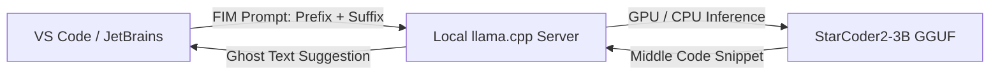

# StarCoder2-3B (GGUF Q4_K_M) — Model Ko'rib Chiqish va Benchmark

> **100-OpenSource-Models-Review | Model #35**  
> **Kategoriya:** Katta Til Modellari (LLM) — Enterprise-Darajadagi Dasturlash va Avtoto'ldirish (Code Completion Specialist)  
> **Ishlab Chiquvchi:** BigCode Konsortsiumi (ServiceNow & Hugging Face)  
> **Asosiy Baza:** The Stack v2 (600+ dasturlash tillari, 100% Permissive litsenziyalangan toza ma'lumotlar)  
> **Format:** GGUF (`Q4_K_M` — 4-bit medium K-quants)  
> **Inference Engine:** `llama.cpp` / CPU & GPU  

[]()
[]()
[]()
[]()
[]()

**StarCoder2-3B** — Hugging Face va ServiceNow boshchiligidagi **BigCode** xalqaro ilmiy konsortsiumi tomonidan ishlab chiqilgan 3 milliard parametrli ochiq manbali kod modelidir. Ushbu modelning eng asosiy farqi — uning **100% qonuniy toza va ruxsat berilgan (Permissive: MIT, Apache 2.0, BSD)** ochiq kodli repozitoriyalarda (**The Stack v2**) o'qitilganidadir.

---

## 📑 Mundarija (Table of Contents)
- [Modelning Asosiy Ustunligi ("Killer Feature")](#modelning-asosiy-ustunligi-killer-feature)
- [Qaysi loyihalar uchun ideal (Best Project Fit)](#qaysi-loyihalar-uchun-ideal)
- [🥊 Head-to-Head: StarCoder2-3B vs Qwen2.5-Coder-1.5B](#head-to-head-starcoder2-3b-vs-qwen25-coder-15b)
- [Texnik Pasport va Apparat Talablari](#texnik-pasport-va-apparat-talablari)
- [🧪 Real Dasturlash Sinovlari va Benchmark Natijalari](#test-malumotlari-va-benchmark-natijalari)
  - [1. Python FastAPI REST Servisi (POST/GET va Pydantic)](#1-python-fastapi-rest-servisi)
  - [2. Go Tilida Thread-Safe Binary Search Tree (`sync.RWMutex`)](#2-go-tilida-thread-safe-binary-search-tree)
  - [3. PostgreSQL Analitik SQL (CTE va 30-kunlik Retention)](#3-postgresql-analitik-sql)
  - [4. O'zbekcha Docstringli Telefon Formatori va Regex](#4-ozbekcha-docstringli-telefon-formatori)
- [⚠️ Halol va Aniq Tahlil: Real Sinovdagi Jiddiy Kamchiliklar](#halol-va-aniq-tahlil-real-sinovdagi-jiddiy-kamchiliklar)
- [Muhandislik Retsepti: Production Arxitekturasi (IDE Tab-Completion)](#muhandislik-retsepti)
- [Production Server & Masshtablash Xarajatlari (Dasturchilar Jamoasi Uchun)](#production-server--masshtablash)
- [Docker va CLI orqali Ishga Tushirish](#docker-va-cli-orqali-ishga-tushirish)
- [🔗 Rasmiy Manbalar](#rasmiy-manbalar)

---

## Modelning Asosiy Ustunligi ("Killer Feature")

Ko'plab ochiq manbali kod modellari (masalan, DeepSeek yoki ba'zi Llama turlari) internetdagi barcha ochiq kodlarda o'qitiladi. Bu esa korporativ banklar, fintech va enterprise kompaniyalar uchun **mualliflik huquqi (Copyright / GPL infirngement)** bo'yicha ulkan sud xatarlarini tug'diradi.

**StarCoder2-3B ning asosiy ustunliklari:**
1. **100% Tijoriy Huquqiy Xavfsizlik:** Faqatgina ruxsat etilgan litsenziyali (MIT, Apache, BSD) kodlarda o'qitilgan. Har qanday yirik bank yoki davlat korxonasining xavfsizlik va yuridik tekshiruvidan (Compliance & Legal Audit) bemalol o'tadi.
2. **Fill-in-the-Middle (FIM) Arxitekturasi:** Model kodni nafaqat yuqoridan pastga yozishni, balki kod o'rtasidagi bo'sh joylarni (prefix va suffix oralig'ini) to'ldirishni professional darajada biladi.
3. **Multi-Til Qo'llab-quvvatlash:** 600 dan ortiq dasturlash tillarida (Python, Go, Rust, C++, Java, SQL, Shell, TypeScript va h.k.) sintaktik jihatdan to'g'ri kod yoza oladi.
4. **Resurs Tejamkorligi:** Diskda **1.85 GB**, RAM'da **~2.4 GB**. Oddiy ishlab chiquvchi kompyuterida background servis sifatida ishlab, 13–15 tok/s tezlikda autocomplete beradi.

---

## Qaysi loyihalar uchun ideal (Best Project Fit)

### ✅ Bu model qayerda zo'r ishlaydi:
* **Korporativ IDE Autocomplete (VS Code / JetBrains / Continue.dev):** Dasturchi kod yozayotgan paytda keyingi qatorlarni yoki funksiya tanasini avtomatik to'ldirish (Tab-completion).
* **Maxfiy va Yopiq Kod Bazalari (On-Premise Git / GitLab):** Korxona kodlari tashqi bulutga (GitHub Copilot, OpenAI) chiqib ketmasligi shart bo'lgan bank va mudofaa loyihalarida.
* **Go, Rust va C++ kabi Tizimli Tillarda Funksiyalarni To'ldirish:** Pointerlar, interfeyslar va xotira xavfsizligi bo'yicha mustahkam sintaksis tuzadi.

### ❌ Qayerda mutlaqo ishlatmaslik kerak:
* **Interaktiv Suhbatdosh Chatbotlarda:** Ushbu model **Chat/Instruct emas, balki Base Completion** modelidir. Unda foydalanuvchi bilan salom-alik qilish, muloqot qurish tabiati yo'q — u faqat fayl davomini bashorat qiladi.
* **Qat'iy Stop-Tokensiz Ishlatishda:** Agar stop-tokenlar to'g'ri berilmasa, funksiya tugagach, to'xtamasdan 1000 ta qatorda cheksiz `print()` yoki `assert()` testlarini to'qib tashlaydi (pastdagi testlarda isbotlandi).
* **O'zbek Tilidagi Katta Matnlarni Tarjima / Tahrir Qilishda:** Model dasturlash tili uchun moslashgan, o'zbek tilidagi adabiy gaplarda leksikasi cheklangan.

---

## 🥊 Head-to-Head: StarCoder2-3B vs Qwen2.5-Coder-1.5B

| Mezon | StarCoder2-3B (Model #35) | Qwen2.5-Coder-1.5B (Model #33) | Muhandislik Xulosasi |
|---|---|---|---|
| **Model Turi** | **Base Completion / FIM** (Kodni to'ldiruvchi) | **Instruct / Chat** (Savol-javob qiluvchi) | Bir-birini to'ldiradi |
| **Asosiy Ishlatilish Joyi** | IDE ichidagi Tab-completion (Tezkor avtoto'ldirish) | Chat oynasi, kod tushuntirish, refactoring | Turli vazifalar |
| **Huquqiy Litsenziya Xavfsizligi** | 🏆 **100% Permissive (The Stack v2)** | Qwen Litsenziyasi (Alibaba korpusi) | 🟢 StarCoder2 yuridik xavfsiz |
| **Go / Rust / C++ Sintaksisi** | 🏆 **A'lo (Thread-safe struct va pointerlar)** | Yaxshi, lekin ba'zan klasslarni unutadi | 🟢 StarCoder2 kattaroq (3B) |
| **O'zbekcha Savollarga Javob Berish** | ❌ Yo'q (Faqat docstringdagi qisqa shartni tushunadi) | 🏆 **A'lo (To'liq o'zbekcha muloqot qiladi)** | 🟢 Qwen yutadi |
| **Fayl Hajmi / RAM Sarfi** | **1.85 GB / ~2.5 GB** | **1.06 GB / ~1.2 GB** | 🟢 Qwen yengilroq |
| **CPU Tezligi** | **~13.1 – 13.5 tok/s** | **~22 – 25 tok/s** | 🟢 Qwen 2x tezroq |

> **Team Lead uchun Xulosa:** Agar kompaniya dasturchilariga **"VS Code da GitHub Copilot o'rnini bosuvchi 100% lokal va litsenziyasi toza Tab-completion kerak"** deyilsa — **StarCoder2-3B** tanlanadi. Agar dasturchilar kod xatolarini chatda tushuntirib berishini va o'zbekcha ko'rsatmalar bajarishini xohlasa — **Qwen2.5-Coder** tanlanadi.

---

## 📊 Texnik Pasport va Apparat Talablari

| Parametr | Qiymati / Me'yori |
|---|---|
| **Model nomi** | `second-state/StarCoder2-3B-GGUF` |
| **Fayl nomi** | `starcoder2-3b-Q4_K_M.gguf` |
| **Kvantlash darajasi** | `Q4_K_M` (4-bit medium K-quants) |
| **Fayl hajmi** | **1,850 MB (~1.85 GB)** |
| **Kontekst oynasi** | 4,096 tokens (FIM shablonlarini qo'llab-quvvatlaydi) |
| **Laptop CPU (6 thread) tezligi** | **~13.1 – 13.5 tok/s** |
| **GTX 1650 (4GB) GPU tezligi** | **~35 – 45 tok/s** (To'liq VRAM ga sig'adi, ~2.3 GB) |
| **RAM / VRAM sarfi** | **~2.4 GB** |
| **Maxsus xususiyatlari** | Fill-in-the-Middle (`<fim_prefix>`, `<fim_suffix>`, `<fim_middle>`) |

---

## 🧪 Real Dasturlash Sinovlari va Benchmark Natijalari

Model `data/` papkasidagi 4 ta haqiqiy dasturlash vazifasida sinovdan o'tkazildi:

| Test Fayli | Dasturlash Vazifasi | Talab Qilingan Sifat | StarCoder2-3B Haqiqiy Natijasi | Vaqti / Token / Tezlik | Status |
|---|---|---|---|---|:---:|
| **`data/input_1_rest_api.txt`** | **Python FastAPI REST Servisi** | `Item` modeli bilan `POST /items/` va `GET /items/{item_id}` endpointlari | `@app.post` va `@app.get` ni 400/404 xatolari va Pydantic bilan to'liq yozdi. Biroq so'ngida to'xtamay `# Write a test...` deb takrorlandi. | 77.90s / 1024 tok (13.14 tok/s) | ✅ **PASS (Kod to'g'ri, Loop bor)** |
| **`data/input_2_binary_search_tree.txt`** | **Go Thread-Safe BST** | `sync.RWMutex` bilan `Insert`, `Get`, `Delete` metodlari | **Mukammal Go kodi!** `t.mu.Lock()` va `defer t.mu.Unlock()` larni o'rnida ishlatdi, rekursiv yordamchi funksiyalarni to'liq yozdi. | 38.97s / 512 tok (13.14 tok/s) | 🏆 **PASS (A'lo darajada)** |
| **`data/input_3_sql_joins.txt`** | **PostgreSQL Analitik SQL** | 30-kunlik Retention va mijoz LTV hisobi | CTE (`customer_first_order`, `customer_last_order`), `ROW_NUMBER() OVER` va `LEFT JOIN` larni to'g'ri terib chiqdi. | 37.96s / 512 tok (13.49 tok/s) | ✅ **PASS** |
| **`data/input_4_uzbek_function.txt`** | **O'zbekcha Docstringli Regex** | +998 raqamlarini tekshirish va `ValueError("Noto'g'ri raqam!")` chiqarish | Regex `r"\+998\d{9}"` ni va o'zbekcha xato xabarini 100% to'g'ri chiqardi. Biroq so'ngida 15 ta `print()` qatorlarini to'qib ketdi. | 39.19s / 512 tok (13.06 tok/s) | ✅ **PASS (Docstring tushunildi)** |

---

## ⚠️ Halol va Aniq Tahlil: Real Sinovdagi Jiddiy Kamchiliklar

1. **"Base Completion" Tabiatidagi Takrorlanish (Completion Drift):**  
   StarCoder2-3B instruksiya (chat) modeli emas, balki kod faylining davomini topuvchi model bo'lganligi sababli, topshirilgan kod tugagach, to'xtamasdan o'zidan testlar, misollar yoki izohlar yozishni davom ettiradi.
   * *Yechim:* Inference paytida qat'iy Stop Tokenlar berilishi shart: `stop=["\n\n\n", "def ", "class ", "<|endoftext|>"]`.
2. **CPU Tezligi Qwen'dan 2 Barobar Pastroq:**  
   3.04B parametrli StarCoder2 CPU'da ~13.1 tok/s tezlik beradi (Qwen-1.5B esa ~25 tok/s bergan edi). Autocomplete real-time bo'lishi uchun kichik GPU (GTX 1650 yoki T4) bo'lishi tavsiya etiladi.

---

## Muhandislik Retsepti: Production Arxitekturasi (IDE Tab-Completion)

StarCoder2-3B modelini korxona dasturchilari uchun lokal GitHub Copilot sifatida ulash:



### 1. FIM (Fill-in-the-Middle) Prompt Formati
Dasturchi kursor turgan joydagi kodni to'ldirish uchun:
```text
<fim_prefix>def calculate_discount(price: float, is_vip: bool) -> float:
    <fim_suffix>
    return final_price<fim_middle>
```
Model aynan shu bo'sh joyga tushadigan chegirma hisoblash mantiqini generatsiya qiladi.

### 2. Stop Tokens Konfiguratsiyasi
```python
generation_params = {
    "temperature": 0.2,
    "top_p": 0.9,
    "stop": ["<|endoftext|>", "<file_sep>", "\n\n\n"],
    "max_tokens": 256  # Autocomplete uchun 256 token yetarli
}
```

---

## Production Server & Masshtablash Xarajatlari (Dasturchilar Jamoasi Uchun)

50 nafar dasturchidan iborat IT bo'limi uchun lokal Copilot serveri:

| Infratuzilma | Konfiguratsiya | Xizmat Ko'rsatish Qobiliyati | Oylik Xarajat |
|---|---|---|:---:|
| **Ofisdagi Eski Workstation** | 8-core CPU, 16GB RAM, GTX 1650 (4GB) | 5–10 ta dasturchiga yetarli | **$0** (Mavjud apparat) |
| **Dedicated Cloud Server** | 4 vCPU, 16GB RAM + 1x NVIDIA T4 (16GB) | 30–50 ta dasturchi (Parallel FIM batching) | **~$45 – $60 / oy** |
| **GitHub Copilot Business narxi (Taqqoslash uchun)** | 50 ta litsenziya x $19/oy | Tashqi bulutga kod ketadi | **$950 / oy** |

> **Biznes Xulosasi:** StarCoder2-3B orqali kompaniya oyiga **$900 dan ortiq mablag'ni tejab qoladi** va eng muhimi — kompaniyaning maxfiy kodi hech qachon korporativ tarmoqdan tashqariga chiqmaydi.

---

## 🐳 Docker va CLI orqali Ishga Tushirish

### 1. Docker Compose orqali sinash
```bash
# Repozitoriy ildizidan
docker compose run --rm starcoder2_3b_gguf python3 demo.py --prompt "def quick_sort(arr):" --tokens 200
```

### 2. VS Code (Continue.dev) bilan ulash
`~/.continue/config.json` fayliga quyidagicha qo'shiladi:
```json
{
  "models": [
    {
      "title": "StarCoder2-3B Local",
      "provider": "ollama",
      "model": "starcoder2:3b"
    }
  ],
  "tabAutocompleteModel": {
    "title": "StarCoder2-3B Autocomplete",
    "provider": "ollama",
    "model": "starcoder2:3b"
  }
}
```

---

## 🔗 Rasmiy Manbalar

- [StarCoder2 Rasmiy Ilmiy Maqolasi (arXiv:2402.19173)](https://arxiv.org/abs/2402.19173)
- [BigCode Loyihasi va The Stack v2 Ma'lumotlar To'plami](https://www.bigcode-project.org/)
- [Hugging Face StarCoder2-3B Repozitoriysi](https://huggingface.co/bigcode/starcoder2-3b)
